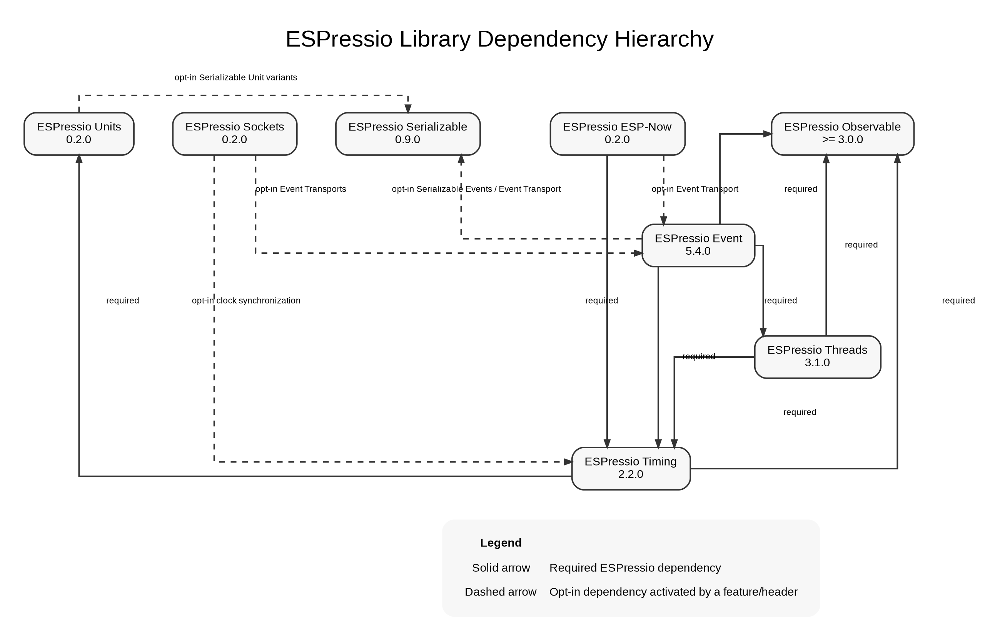

# ESPressio Dependency Chart



## Purpose

This document describes the dependency relationships between the current ESPressio libraries.

The chart is hierarchical: libraries with no **required** ESPressio dependencies are positioned at the top, while libraries that build on progressively more of the ESPressio ecosystem appear lower in the hierarchy.

### Relationship notation

- **Solid arrow** — a required ESPressio library dependency.
- **Dashed arrow** — an opt-in relationship. The dependency is required only when the consuming application selects the associated feature, integration, type, or header.
- Arrows point from the **dependent library** to the **library it consumes**.

This distinction is important to the ESPressio architecture. Optional integrations are intentionally kept out of the normal/core include path wherever possible so that a project does not acquire unrelated ESPressio dependencies simply by consuming a library.

---

## ESPressio Units 0.2.0

**Required ESPressio dependencies: none.**

ESPressio Units is a foundational library providing strongly typed physical quantities and unit representations. Its ordinary Unit types are deliberately independent of the rest of the ESPressio ecosystem.

### ESPressio Units → ESPressio Serializable — opt-in

The ordinary Unit headers do **not** require ESPressio Serializable.

Serializable counterparts are supplied through separate `*_Serializable.hpp` sibling headers, together with the `ESPressio_SerializableUnits.hpp` batch header.

The relationship therefore exists only when an application explicitly selects a Serializable Unit type.

This preserves both use cases:

```text
ordinary Unit type
    -> ESPressio Units only

Serializable Unit type
    -> ESPressio Units
    -> ESPressio Serializable
```

---

## ESPressio Observable >= 3.0.0

**Required ESPressio dependencies: none represented in this chart.**

ESPressio Observable is a foundational synchronous observation/notification mechanism.

It is consumed by higher-level libraries when lifecycle or state changes need to be observable without forcing those notifications through the asynchronous ESPressio Event system.

In the current dependency hierarchy it is directly consumed by:

- ESPressio Timing;
- ESPressio Threads;
- ESPressio Event.

---

## ESPressio Serializable 0.9.0

**Required ESPressio dependencies: none represented in this chart.**

ESPressio Serializable is the foundational serialization framework.

It remains intentionally optional for libraries that can operate entirely with non-Serializable types.

Current opt-in relationships shown in the chart are:

- ESPressio Units → Serializable, when Serializable Unit variants are selected;
- ESPressio Event → Serializable, when Serializable Events or Event Transport are used.

ESPressio Timing can operate with Serializable Unit time representations because its clock types are generic, but Timing itself does not directly depend upon ESPressio Serializable. The Serializable relationship is provided by the selected ESPressio Units time type.

---

## ESPressio Sockets 0.2.0

**Required ESPressio dependencies: none.**

The core ESPressio Sockets library deliberately has no mandatory dependency on another ESPressio library.

It provides socket/network infrastructure and then exposes integrations through opt-in headers.

### ESPressio Sockets → ESPressio Event — opt-in

Socket Event Transport adapters implement the ESPressio Event transport abstraction.

This relationship is activated only when an Event Transport header is used, for example the UDP, TCP, TLS, WebSocket, or MQTT Event Transport adapters.

A project using only the core socket facilities does not require ESPressio Event.

Because Event Transport operates on Serializable Events, the relevant Event/Serializable requirements are then inherited through that selected integration rather than imposed by the Sockets core.

### ESPressio Sockets → ESPressio Timing — opt-in

Version 0.2.0 adds socket-based System Clock synchronization implementations.

The Timing relationship is activated only when the clock-synchronization headers are selected.

These implementations provide network mechanisms such as:

- UDP request/response synchronization;
- UDP broadcast/multicast synchronization;
- TCP synchronization;
- WebSocket synchronization;
- SNTP reference acquisition.

ESPressio Timing continues to own clock discipline, synchronization calculations, System Clock state, and Observer notifications. ESPressio Sockets only supplies the network-side synchronization mechanism.

---

## ESPressio Timing 2.2.0

**Required ESPressio dependencies:**

- ESPressio Units >= 0.2.0;
- ESPressio Observable >= 3.0.0.

### ESPressio Timing → ESPressio Units — required

Timing uses ESPressio Units for its strongly typed time representations.

Timing 2.x is generic over the selected time representation, allowing the implementing application to use ordinary Unit time types, Serializable Unit variants, or another compatible representation.

This is why Timing itself does not need a direct Serializable dependency.

### ESPressio Timing → ESPressio Observable — required

Timing exposes logical clock and synchronization lifecycle notifications through ESPressio Observable.

This includes particularly important System Clock synchronization notifications, allowing observers to inspect relevant synchronization state and values such as the before/after clock difference.

The synchronous Observer layer also provides the source notifications consumed by the optional Timing Event Bridge implemented in ESPressio Event.

---

## ESPressio Threads 3.1.0

**Required ESPressio dependencies:**

- ESPressio Timing >= 2.0.0;
- ESPressio Observable >= 3.0.0.

### ESPressio Threads → ESPressio Timing — required

Threads uses Timing for its time-related execution and scheduling infrastructure.

This establishes Timing—and therefore Timing's own required Units and Observable relationships—beneath Threads in the hierarchy.

### ESPressio Threads → ESPressio Observable — required

Threads uses Observable for synchronous infrastructure notifications.

This includes notifications associated with singleton/infrastructure behavior such as Garbage Collection and other logical lifecycle operations where observers need to react directly.

These Observer notifications deliberately exist independently of ESPressio Event.

ESPressio Event can optionally bridge them into asynchronous Events, but Threads itself does not require Event.

---

## ESPressio ESP-Now 0.2.0

**Required ESPressio dependencies:**

- ESPressio Timing >= 2.1.0.

### ESPressio ESP-Now → ESPressio Timing — required

The library provides ESP-NOW-based distributed System Clock synchronization.

ESPressio ESP-Now gathers the transport-specific timing measurements and submits completed synchronization samples into ESPressio Timing.

Timing remains responsible for the actual clock synchronization and discipline.

### ESPressio ESP-Now → ESPressio Event — opt-in

`ESPNowEventTransport` provides an ESP-NOW implementation of the ESPressio Event transport abstraction.

The Event dependency is deliberately opt-in.

Applications using ESPressio ESP-Now only for ESP-NOW communication and/or System Clock synchronization do not need ESPressio Event.

When `ESPNowEventTransport` is selected, the application also acquires the Serializable requirements associated with ESPressio Event Transport.

---

## ESPressio Event 5.4.0

**Required ESPressio dependencies:**

- ESPressio Threads >= 3.1.0;
- ESPressio Observable >= 3.0.0;
- ESPressio Timing >= 2.2.0.

Event currently sits at the deepest point in the core ESPressio dependency hierarchy represented here.

### ESPressio Event → ESPressio Threads — required

Event uses ESPressio Threads for its asynchronous Event processing/execution infrastructure.

Because Threads itself requires Timing and Observable, those relationships also exist transitively beneath Event.

### ESPressio Event → ESPressio Observable — required

Observable is used directly by Event and by the Observer/Event bridge architecture.

This direct dependency allows ESPressio Event to convert synchronous Observer notifications from other ESPressio subsystems into asynchronous Event dispatches without requiring those source libraries to depend upon Event.

### ESPressio Event → ESPressio Timing — required

Timing is a direct Event dependency because the optional System Clock Event Bridge compiles against Timing's public Observer API.

The bridge subscribes to Timing Observer notifications and emits corresponding asynchronous Timing Event types.

The same architectural pattern is used for the Threads infrastructure Event Bridges.

Importantly, the dependency direction remains:

```text
ESPressio Event
    -> ESPressio Timing / Threads

not

ESPressio Timing / Threads
    -> ESPressio Event
```

This prevents foundational/runtime libraries from acquiring an Event dependency merely to make asynchronous bridging possible.

### ESPressio Event → ESPressio Serializable — opt-in

Ordinary Event usage does not require ESPressio Serializable.

Serializable Event support and Event Transport are explicitly opt-in.

When those facilities are selected, Serializable provides the representation required to encode an Event for transport beyond the local Event dispatcher.

This preserves the lightweight local-only case:

```text
ordinary local Event
    -> no Serializable requirement
```

while supporting:

```text
Serializable / remotely transported Event
    -> ESPressio Serializable
```

---

## Dependency hierarchy summary

The required-dependency hierarchy can be summarized as:

```text
FOUNDATIONAL
├── ESPressio Units
├── ESPressio Observable
├── ESPressio Serializable
└── ESPressio Sockets
        |
        | optional integrations only
        v

RUNTIME
└── ESPressio Timing
    ├── Units
    └── Observable

EXECUTION / COMMUNICATION
├── ESPressio Threads
│   ├── Timing
│   └── Observable
│
└── ESPressio ESP-Now
    └── Timing

EVENT INFRASTRUCTURE
└── ESPressio Event
    ├── Threads
    ├── Timing
    └── Observable
```

The opt-in cross-cutting relationships are:

```text
Units
  - - -> Serializable
         Serializable Unit variants

Event
  - - -> Serializable
         Serializable Events / Event Transport

ESP-Now
  - - -> Event
         ESP-NOW Event Transport

Sockets
  - - -> Event
         socket Event Transports

Sockets
  - - -> Timing
         socket/SNTP clock synchronization
```

---

## Architectural principle

The dependency graph follows a general ESPressio design rule:

> A foundational library should expose the synchronous or transport-neutral abstraction it owns; higher-level integration libraries should opt into that abstraction rather than forcing the foundational library to depend upward.

Examples include:

```text
Timing
    exposes Observer notifications

Event
    optionally bridges those notifications into Events
```

```text
Timing
    exposes transport-neutral clock synchronization

ESP-Now / Sockets
    provide concrete synchronization transports
```

```text
Event
    exposes transport-neutral Event Transport

ESP-Now / Sockets
    provide concrete Event transports
```

and:

```text
Units
    provides ordinary Unit types

Units + Serializable
    optionally provides Serializable Unit variants
```

This keeps the individual libraries independently useful while allowing progressively richer ESPressio compositions without imposing unnecessary dependencies on applications that do not use those integrations.
