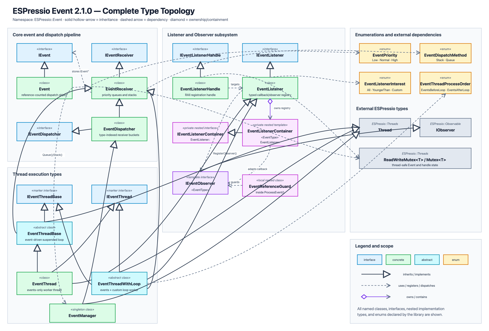
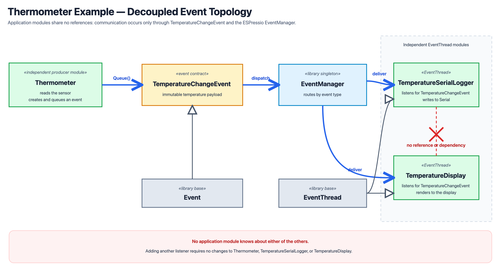

# ESPressio Event
Event-Driven Observer Pattern Components of the Flowduino ESPressio Development Platform

Provides a foundation for designing, structuring, and implementing your embedded programs using Event Pattern (Event-Driven Development or "EDD").

## Latest Stable Version
The latest Stable Version is [3.0.1](https://github.com/Flowduino/ESPressio-Event/releases/tag/3.0.1).

## Compatibility

ESPressio Event currently targets the **ESP32 family** using the Arduino framework. This includes classic ESP32 and current single- and multi-core variants such as ESP32-S2, ESP32-S3, ESP32-C3, ESP32-C6, ESP32-H2, and ESP32-P4 when they are supported by the installed Arduino-ESP32 core.

The ESP32 restriction comes from the required ESPressio Threads dependency and the library's direct use of ESP-IDF FreeRTOS semaphores. The build must also provide C++ RTTI, `std::shared_mutex`, and Arduino `String`. ESP8266, AVR, SAMD, RP2040, STM32, Renesas, and other non-ESP32 Arduino targets are not currently supported by the complete library.

Compatibility is source-derived; each board/core/toolchain combination should still be verified by compiling for the intended target.

## ESPressio Development Platform
The **ESPressio** Development Platform is a collection of discrete (sometimes intra-connected) Component Libraries developed with a particular development ethos in mind.

The key objectives of the ESPressio Development Platform are:
- **Light-weight** - The Components should always strive to optimize memory consumption and operational overhead as much as possible, but not to the detriment of...
- **Ease of Use** - Many of our components serve as Developer-Friendly Abstractions of existing procedural code libraries.
- **Object-Oriented** - A `type` for everything, and everything in a `type`!
- **SOLID**:
- -  > **S**ingle Responsibility Principle (SRP)
    Break your code into smaller, focused components.
- - > **O**pen/Closed Principle (OCP)
    Be open for extension but closed for modification.
- - > **L**iskov Substitution Principle (LSP)
    Be substitutable for the base type without altering correctness.
- - > **I**nterface Segregation Principle (ISP)
    Break interfaces into specific, client-focused ones.
- - > **D**ependency Inversion Principle (DIP)
    Be dependent on abstractions, not concretions.

To the maximum extent possible within the limitations/restrictons/constraints of the C++ langauge, the Arduino platform, and Microcontroller Programming itself, all Component Libraries of the **ESPressio** Development Platform must strive to honour the **SOLID** principles.

## License
ESPressio (and its component libraries, including this one) are subject to the *Apache License 2.0*
Please see the [](LICENSE) accompanying this library for full details.

## Namespace
Every type/variable/constant/etc. related to *ESPressio* Event are located within the `Event` sub-namespace of the `ESPressio` parent namespace.

The namespace provides the following (*click on any declaration to navigate to more info*):
- [`ESPressio::Event::IEvent`](#ievent)
- [`ESPressio::Event::Event`](#event)
- [`ESPressio::Event::IEventThread`](#ieventthread)
- [`ESPressio::Event::EventThread`](#eventthread)
- [`ESPressio::Event::PrecisionEventThread`](#precisioneventthread)
- `ESPressio::Event::PrecisionEventProcessOrder`
- `ESPressio::Event::PrecisionEventArrivalPolicy`
- `ESPressio::Event::IEventObserver<EventType>`

## Dependencies
The ESPressio Event library depends on:

* [`ESPressio Threads`](https://github.com/Flowduino/ESPressio-Threads) 1.4.1 or later for asynchronous Event processing.
* [`ESPressio Observable`](https://github.com/Flowduino/ESPressio-Observable) 2.0.0 or later for its common `IObserver` contract and typed Event Observer support.

PlatformIO resolves both dependencies from `library.json` automatically.

## Platformio.ini
You can quickly and easily add this library to your project in PlatformIO by simply including the following in your `platformio.ini` file:

```ini
lib_deps =
    flowduino/ESPressio-Threads@^1.4.1
    flowduino/ESPressio-Observable@^2.0.0
    flowduino/ESPressio-Event@^3.0.1
```

Alternatively, if you want to use the bleeding-edge (effectively "Developer Integration Testing" or "DIT") sources, you can instead use:

```ini
lib_deps = 
    https://github.com/Flowduino/ESPressio-Threads.git
    https://github.com/Flowduino/ESPressio-Observable.git
    https://github.com/Flowduino/ESPressio-Event.git
```
Please note that this will use the very latest commits pushed into the repository, so volatility is possible.

## RTTI is required for this library!
This library leverages fundamnetal C++ language features that in turn necessitate the use of RTTI (**R**un**T**ime **T**ype **I**nformation).

If you are developing with the Arduino framework but with the ESPressif platform, as of Febraury 22nd 2024, you may need to modify your Platformio.ini configuration as shown below to use a newer (pre-release) version of the packages where RTTI does not break any functionality when using `#include <FS.h>` in your code:
```ini
platform = https://github.com/platformio/platform-espressif32.git
platform_packages = framework-arduinoespressif32 @ https://github.com/espressif/arduino-esp32.git
```
>Note that we have been informed that the next major release of the platform will resolve this issue, eliminating this requirement. However, as of February 22nd 2024, the above lines included in your Platformio.ini file is required.

Additionally, you should always define the following in your Platformio.ini file's build configurations:
```ini
build_unflags =
	-fno-rtti
```
Where the above explicitly enables RTTI in your build configuration.

## What is "Event-Driven" Observer Pattern?
Event-Driven Observer Pattern is a means of fully (and truly) decoupling your code from each distinct functionality.

By Dispatching `Event`s (*through a `Queue` or a `Stack`, see later*) containing context-specific "payload" information, and having separate code *Listen* for those Events, we are able to ensure that no direct relationship need exist between either distinct functionality.

In this way, distinct functionalities can be developed in total indepdenence of each other, and all that need be agreed are the Events that will be Dispatched and Received. 

Effectively, an `Event` is an *Interface* (a "data contract"), containing *payload* information populated by the *origin* of the `Event`, and *consumed* by any and all `EventListener`s of that `Event`.

A central `EventManager` acts as a *Dispatch Manager*, coordinating the transit of `Event`s to all relevant `EventListener`s.

This *ESPressio Event* library ensures that each `EventListener` only receives `Event`s of the relevant type, so any `Event` type can be dispatched trivially from *anywhere* in your codebase.

Ultimately, *Event-Driven Observer Pattern* is a logical evolution of the more conventional *Observer Pattern* (as implemented in [ESPressio-Observable](https://github.com/Flowduino/ESPressio-Observable)), where the only "coupling" within your codebase is between each discrete object implementation and the central `EventManager`.

### Order Of Execution
It is important to understand that Event-Driven Observer Pattern does not enforce any specific *Order of Execution*.

When an `Event` is *Dispatched* (via a `Queue` or a `Stack`), that `Event` is passed along to each `EventListener` in no specific order.

Keep this in mind when designing your program, because - should you require an enforced *Order of Execution*, you may need to mix Event-Driven Observer Pattern with conventional Observer Pattern implementations... whatever is most appropriate for each specific use-case.

### Events are Asynchronous
Whenever an `Event` is dispatched, the execution chain from whence it was dispatched shall continue to the next instruction without waiting for the `Event` to be processed by all `EventListener`s.

This is fundamnetal to the concept of Event-Driven Observer Pattern, as the dispatching code for any given `Event` must never need to know about what `EventListener`s (indeed if any at all) are interested in that `Event`.

In essence, `Event`s are **fire and forget**.

This is a favourable concept of Event-Driven Observer Pattern, and one you should take full advantage of when it comes to logicially separating distinct processes within your execution chains.

### Reciprocal Events
In order to reconcile the previously-stated fact that `Event`s are processed entirely Asynchronously, your design can (and should) take advantage of the fact that any `EventListener` for an `Event` can dispatch a *Reciprocal `Event`*, effectively containing payload data consisting of the processed results of the initially-received `Event`.

This may sound more complicated than it really is, so please read the rest of this document (particularly the illustrative examples herein) which make the design concept extremely clear.

The key to note at this point is that any `EventListener` can dispatch any number of `Event`s of its own (as necessary) at any time... and that this provides a fully-decoupled solution for what might otherwise need to be a "circular reference".

## Once you go Event-Driven, you won't go back!
Event-Driven Observer Pattern, once you've learned the necessary design concepts to leverage it properly in your own code, is an impressively clean way of satisfying the SOLID principles of development.

It is particularly powerful when it comes to developing *Modular Code*, which can be quickly and easily extended without the need to modify previously-implemented "Modules" within your codebase.

With that said, it is important to understand that no single design pattern is correct for every requirement, and this document shall strive to teach you when it's best to use Event-Driven Observer Pattern, and when it's better to use a *Synchronous* Observer Pattern instead.

## Understanding the Components of *ESPressio Event*
Before we begin looking at code samples, it's useful to understand the Components of this Library... what they are and what they do.

### Complete Type Topology

The diagram below shows every class, interface, nested implementation type, and enumeration declared by ESPressio Event, together with its inheritance, ownership, and principal usage relationships. External base types from ESPressio Threads and ESPressio Observable are shown in grey.

[](diagrams/espressio-event-type-topology.png)

The editable vector source is available at [`diagrams/espressio-event-type-topology.svg`](diagrams/espressio-event-type-topology.svg).

### `Event`
An `Event` is simply an object containing information.

With this *ESPressio Event* library, every `Event` is a `class` inheriting from `Event`

`Event`s must be *idempotent*, meaning that the values of the members contained within an `Event` must not be *editable* once the `Event` has been dispatched. This is because the *same* `Event` will be handed off to all `EventListener`s for that `Event` Type, and it is imperative that no `EventListener` modify any values (particularly as there is no way to know the order in which the `EventListener`s will receive - and process - the `Event`)

Additionally, every `EventListener` will process the same `Event` *on its own `EventThread`*, so idempotence of `Event`s eliminates the need to worry about Thread-Safety.

>TL;DR: No member of an `Event` may be modified once the `Event` has been dispatched (`Queue()` or `Stack()`).

`Event`s are also **reference counted** once dispatched. This means that you should **not** retain a *reference* or *pointer* to an `Event` once it has been dispatched, because the `Event` will be automatically destroyed once all `EventListener`s have processed it.

>Remember: `Event`s are *"fire and forget."*

Event dispatch timestamps use ESPressio-Timing's shared `SystemClock` instead
of Arduino `millis()`. `GetDispatchTime()` and `GetTimeSinceDispatch()` both
return `EventTime`, an alias of `Timing::ClockTime`. The value therefore retains
the highest precision available from the active System Clock source and can be
converted to whichever unit best expresses the caller's requirement:

```cpp
EventTime age = event->GetTimeSinceDispatch();
uint64_t ageMicroseconds =
    age.ToMagnitude<uint64_t>(Units::Micro);
```

Before first dispatch, both values are zero. The first call to `Queue()` or
`Stack()` records the dispatch time; redispatching the same Event does not
replace it. Event age assumes that the shared System Clock is not rebased while
dispatched Events remain in flight. Calling `SystemClock::SetTime()` during
that interval can invalidate elapsed-time results.

### `EventThread`

`EventThread` is the heart and soul of the library, and is the class from which your distinct *modules* of code should inherit.

It is built on top of `Thread`, from the [ESPressio-Threads](https://github.com/Flowduino/ESPressio-Threads) library, but functions quite differently.

Where a conventional `Thread` object provides a *Loop* within which your case-specific implementation is contained, an `EventThread` does not execute on a *loop* at all.

Instead, the `EventThread` sits, patiently and efficiently, in a *suspended state* until any `Event` for which an `EventListener` is registered within your `EventThread` is dispatched through the `EventManager`.

When a relevant `Event` is passed from the `EventManager` to your `EventThread`, the `Event`-specific method you defined for the corresponding `EventListener` is invoked.

Once all `Event`s relevant to your `EventThread` have been processed, the `EventThread` returns to the *suspended state*, waiting (without consuming cycles) for the next `Event` of relevance to arrive.

You will see examples of `EventThread` in action later in this document.

>Remember: While only Event-capable Thread types such as `EventThread`,
>`EventThreadWithLoop`, and `PrecisionEventThread` may receive and process
>`Event`s, an `Event` may be created and dispatched from *anywhere* in your
>code at any time.

### `PrecisionEventThread`

`PrecisionEventThread` combines the typed Event reception and listener
capabilities of `EventThread` with the high-resolution periodic scheduling of
ESPressio-Threads `PrecisionThread`.

Use it when a component must perform work at a controlled cadence while also
accepting Events which update the state used by that work. An ordinary
`EventThread` remains the better choice when work should happen only in direct
response to an Event. `EventThreadWithLoop` remains suitable for an
unregulated continuous loop with Event processing before or after each loop.

Derive from `PrecisionEventThread` and implement `OnIteration()`:

```cpp
void OnIteration(
    IterationTime delta,
    IterationTime startTime,
    Threads::SkippedIterationCount skippedIterations
) override;
```

The inherited `PrecisionThread` implementation retains ownership of its final
scheduling loop. `PrecisionEventThread` processes pending Events around the
consumer's `OnIteration()` hook and retains all inherited timing configuration,
statistics, lifecycle observation, and precision-iteration observation.

#### Event Processing Order

Use `SetEventProcessOrder()` to select where pending Events are processed:

- `PrecisionEventProcessOrder::EventsBeforeIteration` processes Events before
  `OnIteration()` and is the default. This is useful when Events update inputs
  or configuration needed by the current iteration.
- `PrecisionEventProcessOrder::EventsAfterIteration` invokes `OnIteration()`
  first and processes Events afterward. Their changes become visible to the
  next iteration.

The policy is snapshotted once per iteration. Changing it concurrently cannot
cause one iteration to process Events both before and after `OnIteration()`.

#### Event Arrival Policy

Use `SetEventArrivalPolicy()` to control whether a newly received Event affects
the current schedule:

- `PrecisionEventArrivalPolicy::ProcessOnNextIteration` leaves the Event queued
  until the next scheduled iteration and is the default. It preserves cadence,
  with an Event latency of up to one iteration period.
- `PrecisionEventArrivalPolicy::TriggerImmediateIteration` calls the inherited
  `Bump()` operation when an Event arrives. The waiting Thread wakes and begins
  an iteration immediately. That iteration reports zero skipped iterations
  unless scheduled deadlines were independently missed, and the regular
  cadence continues from the immediate iteration.
- `PrecisionEventArrivalPolicy::ProcessImmediately` wakes the Thread and
  processes pending Events on its own FreeRTOS task without invoking
  `OnIteration()`. The scheduled iteration deadline, iteration measurements,
  skipped-iteration count, and iteration Observer notifications are unaffected.
  Multiple Events received before the Thread runs may be processed together in
  one event-only pass.

An Event arriving while the Thread is paused remains queued. Neither policy
implicitly resumes a paused Thread; `Start()` processes the Event after the
Thread resumes. Here, "immediately" means asynchronously as soon as the owning
task is scheduled; Event handlers are never moved onto the dispatching task.

Each Event phase drains all currently pending stacks and queues in their normal
priority and dispatch order. Event handlers therefore contribute to iteration
duration and can cause later deadlines to be skipped. Keep handlers short;
`skippedIterations` and the inherited frequency statistics expose the effects
of overruns.

#### Precision Event Thread Example

```cpp
#include <ESPressio_Event.hpp>
#include <ESPressio_PrecisionEventThread.hpp>
#include <ESPressio_ThreadManager.hpp>

using namespace ESPressio;

class SetpointEvent final : public Event::Event {
    private:
        const int _setpoint;

    public:
        explicit SetpointEvent(int setpoint) : _setpoint(setpoint) { }
        int GetSetpoint() const { return _setpoint; }
};

class ControlThread final : public Event::PrecisionEventThread {
    private:
        int _setpoint = 0;

    protected:
        void OnIteration(
            IterationTime delta,
            IterationTime startTime,
            Threads::SkippedIterationCount skippedIterations
        ) override {
            (void)delta;
            (void)startTime;

            Serial.printf(
                "control setpoint=%d skipped=%llu\n",
                _setpoint,
                static_cast<unsigned long long>(skippedIterations)
            );
        }

    public:
        void ApplySetpoint(SetpointEvent* event) {
            _setpoint = event->GetSetpoint();
        }
};

ControlThread controlThread;
Event::IEventListenerHandle* setpointListener = nullptr;

void setup() {
    Serial.begin(115200);

    controlThread.SetIterationPeriod(
        Units::MilliSeconds<uint64_t>(10)
    );
    controlThread.SetEventProcessOrder(
        Event::PrecisionEventProcessOrder::EventsBeforeIteration
    );
    controlThread.SetEventArrivalPolicy(
        Event::PrecisionEventArrivalPolicy::ProcessImmediately
    );

    setpointListener = controlThread.RegisterListener<SetpointEvent>(
        [](SetpointEvent* event, Event::EventDispatchMethod, Event::EventPriority) {
            controlThread.ApplySetpoint(event);
        }
    );

    Threads::ThreadManager::GetInstance()->Initialize();
}

void loop() {
    static int nextSetpoint = 1;
    (new SetpointEvent(nextSetpoint++))->Queue();
    delay(1000);
}
```

`PrecisionEventThread` inherits `RegisterThreadObserver()` and
`RegisterIterationObserver()`. Typed Event Observers continue to register
through `RegisterObserver<EventType>()`. A single object may implement all
three Observer interfaces and register separately for lifecycle, iteration,
and Event notifications.

### `EventListener`
An `EventListener` is analogous of an *Event Processor*.

You register `EventListener`s inside each of your `EventThread` descendants, and each `EventListener` is type-specialized to a specific `Event` type (a `class` inheriting from `Event`).

Whenever an `Event` of that corresponding type is dispatched, it is handed off to the individual `Queue` or `Stack` of your `EventListener`s parent `EventThread`.

When your `EventListener`'s parent `EventThread` then processes its internal `Event` `Queue` and `Stack` it will invoke the processing method (typically a *Lambda Function*) associated with your `EventListener`, with the `Event` itself passed into the processing method as a Parameter.

You can invoke `RegisterListener` and `UnregisterListener` against any `EventListener` at any time. This means that you can, in effect, deactivate a specific `EventListener` when the execution state of your program would benefit from doing so, and no `Event` will be passed along to it.

This is more efficient than managing a flag (e.g. a `bool`) and interrogating its state each time an `EventListener` is processing an `Event` to determine whether to process it or not.

### Typed Event Observers

Every callback-based Event listener can alternatively be expressed as an Observer. Define a class implementing `IEventObserver<EventType>` and register it through the same `EventListener` or `EventThread`:

```cpp
#include <ESPressio_EventObserver.hpp>
#include <ESPressio_EventThread.hpp>

class TemperatureObserver : public IEventObserver<TemperatureChangeEvent> {
    public:
        void OnEvent(
            TemperatureChangeEvent* event,
            EventDispatchMethod dispatchMethod,
            EventPriority priority
        ) override {
            int temperatureChange =
                event->GetNewTemperature() - event->GetPreviousTemperature();
            const char* direction = temperatureChange > 0 ? "UP" : "DOWN";
            int degreesChanged =
                temperatureChange > 0 ? temperatureChange : -temperatureChange;

            Serial.printf(
                "Temperature is %s by %d degrees (from %d to %d).",
                direction,
                degreesChanged,
                event->GetPreviousTemperature(),
                event->GetNewTemperature()
            );
        }
};

TemperatureObserver temperatureObserver;
IEventListenerHandle* observerHandle =
    eventThread.RegisterObserver<TemperatureChangeEvent>(&temperatureObserver);
```

`IEventObserver<EventType>` derives from ESPressio Observable 2.0's `IObserver` interface. The Event library adapts its virtual methods into the existing asynchronous listener pipeline, so callback listeners and Observers can coexist for the same Event type and receive identical Event, dispatch-method, and priority values.

Observers are non-owning. An Observer must remain alive until its returned `IEventListenerHandle` has been unregistered or deleted. The handle remains owned by the caller, exactly as with `RegisterListener()`.

The normal listener interest modes are supported:

```cpp
IEventListenerHandle* observerHandle =
    eventThread.RegisterObserver<TemperatureChangeEvent>(
        &temperatureObserver,
        EventListenerInterest::YoungerThan,
        EventTime(100, Units::Milli)
    );
```

The `YoungerThan` threshold is also an `EventTime`, so listener and Observer
age filters use the same typed, high-resolution time contract as the Event.

For `EventListenerInterest::Custom`, override `IsInterestedInEvent()` instead of supplying a predicate callback:

```cpp
bool IsInterestedInEvent(TemperatureChangeEvent* event) override {
    return event->GetNewTemperature() >= 30;
}
```

An Observer can implement multiple `IEventObserver<EventType>` interfaces and register each one independently. Each registration has its own `IEventListenerHandle` and interest policy.

### `EventManager`
The `EventManager` is a singular, central `Event` Dispatch Handler for all `Event` types in your implementation.

Each time an `EventListener` is registered with its parent `EventThread`, the `EventThread` notifies the `EventManager` (automatically, you do not need to write any code to achieve this) that your specific `EventThread` instance is interested in `Event`s of the corresponding type.

Whenever an `Event` of a relevant type is Dispatched (through the `Queue` or `Stack`), the `EventManager` knows exactly which `EventThread`(s) to pass that `Event` along to for processing.

>Remember: You never need to create an instance of `EventManager`, it is a self-managed "singleton" instance that will be automatically created when the first `Event` is dispatched, from which point it will exist for the remainder of your program's execution.

Aside from a small amount of allocated active memory (only what is strictly necessary), the `EventManager` does not consume any resources when it is inactive (it waits in a *suspended state* until there is work to be done).

### Other Internal Components
There are a number of other Interfaces and Concrete Implementations within this library, however they are all intended strictly for internal consumption, therefore are beyond the scope of this document.

## Usage Examples
Now we get to the fun part of this document, where we learn how to actually use the *ESPressio Event* library in your own code.

Before we get to the code, let's conceive of a scenario and define some basic specification.

Let's presume that we have a sensor attached to our microcontroller, capable of reading temperature.

Whenever the temperature changes, we want to dispatch an `Event` so that any number of `EventListeners` can process that information for their own purposes.

Meanwhile, we require an `EventListener` to output a line to the Serial monitor informing that the temperature has changed.

Our microcontroller hardware has a display module, so we also want an `EventListener` to render the temperature information on that display module.

For the moment, that completes the terse requirements for our code examples to satisfy.

Let's begin by defining an `Event` for whenever the temperature changes.

### `TemperatureChangeEvent`
We'll create a header file named `TemperatureChangeEvent.hpp`:
```cpp
#pragma once

#include <ESPressio_Event.hpp>

using namespace ESPressio::Event;

class TemperatureChangeEvent : public Event {
    private:
        int _previousTemperature;
        int _newTemperature;
    public:
        TemperatureChangeEvent(int previousTemperature, int newTemperature)
            : _previousTemperature(previousTemperature),
              _newTemperature(newTemperature) { }

        int GetPreviousTemperature() const { return _previousTemperature; }
        int GetNewTemperature() const { return _newTemperature; }
};
```
The above shows how easy it is to define an `Event` type.

There are a few things to note here:
* We need to include `ESPressio_Event.hpp` as this contains the `Event` base class.
* We need to ensure we're using the `namespace` `ESPressio::Event` because the `Event` class is a member of this namespace.
* Both the previous and new temperatures are supplied through the `constructor`, and no setters are provided. This preserves the event's idempotence while allowing listeners to understand the complete temperature transition.

With the `Event` type now defined, it is possible to concurrently implement both the module of code taking temperature readings from the sensor, as well as the module that will display temperature changes in the Serial monitor *and* the module that will display temperature information on your device's physical display.

This is particularly useful if you are part of a development team, as it becomes trivial to distribute the tasks to separate team members (making your overall development more efficient).

Okay, the `Event` is ready, let's move on to the Serial monitor outputting module.

### `TemperatureSerialLogger`
We'll create another header file named `TemperatureSerialLogger.hpp`:
```cpp
#pragma once

#include <Arduino.h> // You may want to change this depending on your Platform/Framework

#include <ESPressio_EventThread.hpp>
#include <ESPressio_EventEnums.hpp>
#include "TemperatureChangeEvent.hpp" // < contains our Event

using namespace ESPressio::Event;

class TemperatureSerialLogger : public EventThread {
    private:
        IEventListenerHandle* _temperatureChangeEventListener = RegisterListener<TemperatureChangeEvent>(
            [&](TemperatureChangeEvent* event, EventDispatchMethod dispatchMethod, EventPriority priority) {
                int temperatureChange =
                    event->GetNewTemperature() - event->GetPreviousTemperature();
                const char* direction = temperatureChange > 0 ? "UP" : "DOWN";
                int degreesChanged =
                    temperatureChange > 0 ? temperatureChange : -temperatureChange;

                Serial.printf(
                    "Temperature is %s by %d degrees (from %d to %d).",
                    direction,
                    degreesChanged,
                    event->GetPreviousTemperature(),
                    event->GetNewTemperature()
                );
            }
        );
    public:
        TemperatureSerialLogger() : EventThread(false) { }

        ~TemperatureSerialLogger() {
            delete _temperatureChangeEventListener;
        }
};
```
The above shows how trivial it can be to implement an `EventThread` and define an `EventListener` for our `TemperatureChangeEvent` `Event` type. Because the event carries both readings, the listener can determine whether the temperature moved `UP` or `DOWN` and calculate the magnitude of the change without retaining any temperature state of its own.

Again, there are a few things to note here:
* We need to include `ESPressio_EventThread.hpp` to access the `EventThread` base class.
* We also need to include `ESPressio_EventEnums` because this contains the declarations of `EventDispatchMethod` and `EventPriority`, both of which are explicitly passed along to `EventListener`s' respective `Event` Processing *Lambda Functions*.
* Of course, we must include any and all headers containing the declarations of the relevant `Event` types, in this example, `TemperatureChangeEvent.hpp`.
* Any `class` intent on listening for and processing `Event`s *must* inherit from `EventThread`.
* We can implement our `EventListener` in-place within the `class` declaration (as shown above), but we *can* also implement the same `EventListener` explicitly in a `constructor` if we prefer.
* The `Event` type for the `EventListener` is specified by way of the template type specialization (`<TemperatureChangeEvent>` in this example)
* Invoking the internal (`protected`) method of `EventThread` called `RegisterListener` will return a `pointer` to an `IEventListenerHandle`. This handle should be retained for the lifetime of the `_temperatureChangeEventListener` member. In this example, that lifetime is that of its parent (encapsulating) `TemperatureSerialLogger` class instance.
* It is necessary to manage the lifetime of the `IEventListenerHandle` `pointer`, which we suitable handle in this example by declaring the `destructor` and instructing it to `delete _temperatureChangeEventListener;`. Failure to do this would result in a *memory leak* each time an instance of `TemperatureSerialLogger` is destroyed.

Now we can move on to the module responsible for drawing the temperature on the hardware device's physical display unit.

### `TemperatureDisplay`
We'll create another header file named `TemperatureDisplay.hpp`:
```cpp
#pragma once

#include <ESPressio_EventThread.hpp>
#include <ESPressio_EventEnums.hpp>
#include "TemperatureChangeEvent.hpp" // < contains our Event

using namespace ESPressio::Event;

class TemperatureDisplay : public EventThread {
    private:
        IEventListenerHandle* _temperatureChangeEventListener = RegisterListener<TemperatureChangeEvent>(
            [&](TemperatureChangeEvent* event, EventDispatchMethod dispatchMethod, EventPriority priority) {
                // Code here to render the value of `event->GetNewTemperature()` on the physical display unit for this hardware device.
            }
        );
    public:
        TemperatureDisplay() : EventThread(false) { }

        ~TemperatureDisplay() {
            delete _temperatureChangeEventListener;
        }
};
```
You will notice that the code is almost 100% identical for `TemperatureDisplay` and `TemperatureSerialLogger`. The only difference is the contents of the *Lambda Function* executed when the `TemperatureChangeEvent` is being processed by this `EventListener`.

Given that there are a vast number of different physical display units available, we have decided not to include actual rendering code in this example because it is beyond the scope of this document. However, you can see clearly in the above code example *where* you would add the specific code to render the temperature on *your* physical display unit.

So, the `Event` is defined, both of our `EventListener`s (and their encapsulating `EventThread`s) have been defined... all that remains is to implement the `Thermometer` module itself.

### `Thermometer`
We'll create another header file named `Thermometer.hpp`:
```cpp
#pragma once

#include "TemperatureChangeEvent.hpp" // < contains our Event

class Thermometer {
    private:
        int _temperature = 0;
    public:
        void UpdateTemperature() {
            // Code here to read the temperature value from the sensor into an `int` variable named `temperature`
            if (_temperature == temperature) { return; } // If the temperature hasn't changed, we can simply return.

            // If we made it here, the temperature has changed.

            int previousTemperature = _temperature;
            _temperature = temperature; // Update the stored temperature to compare next time

            (new TemperatureChangeEvent(previousTemperature, temperature))->Queue(); // Dispatch our `TemperatureChangeEvent`
        }
}
```
The above code example defines a simple `class` named `Thermometer`, whose `UpdateTemperature()` method can be called in the `loop()` method of the `.ino` or `main.cpp` file.

This is the most simplistic example possible, but we want to illustrate the point that you can dispatch an `Event` from literally anywhere in your code.

A couple of things to note:
* We've ommitted code from this example that would be specific to any one sensor unit, since there are a vast number of them with different methods to read their data.
* The previous temperature is captured before `_temperature` is updated, allowing the event to describe the complete transition.
* The only real line of significance is `(new TemperatureChangeEvent(previousTemperature, temperature))->Queue();`.
* The above line not only instantiates a `TemperatureChangeEvent` with both temperature values, it dispatches it through the `Queue` with a `Normal` priority (where no parameter values are given, the `Normal` priority `Queue` or `Stack` will be used).
* This example dispatches the `Event` instance via a `Queue` (first in, first out), but you can substitute `Queue()` for `Stack()` to dispatch the `Event` instance via a `Stack` (last in, first out) instead.

Okay, the *modules* are all defined and implemented, so all that remains is to implement our `.ino` or `main.cpp` file (depending on what IDE you're using for your development work)

### `.ino` file or `main.cpp`
Let's just dive right in here:
```cpp
#include <Arduino.h>
#include <unordered_map>

#include <ESPressio_IThread.hpp>

#include "TemperatureSerialLogger.hpp"
#include "TemperatureDisplay.hpp"
#include "Thermometer.hpp"

using ESPressio::Threads::IThread;
using ESPressio::Threads::ThreadInitializationStatus;
using ESPressio::Event::EventThread;

TemperatureSerialLogger temperatureSerialLogger;
TemperatureDisplay temperatureDisplay;
Thermometer thermometer;

bool eventThreadsReady = false;

const std::unordered_map<ThreadInitializationStatus, String>
    initializationStatusNames = {
        {ThreadInitializationStatus::Success, "Success"},
        {ThreadInitializationStatus::AlreadyInitialized, "AlreadyInitialized"},
        {ThreadInitializationStatus::InvalidState, "InvalidState"},
        {ThreadInitializationStatus::ExitSignalUnavailable, "ExitSignalUnavailable"},
        {ThreadInitializationStatus::TerminationDispatcherUnavailable, "TerminationDispatcherUnavailable"},
        {ThreadInitializationStatus::TerminationDispatchPending, "TerminationDispatchPending"},
        {ThreadInitializationStatus::TaskCreationFailed, "TaskCreationFailed"},
        {ThreadInitializationStatus::ConcurrentInitializationLost, "ConcurrentInitializationLost"},
        {ThreadInitializationStatus::TerminatedDuringInitialization, "TerminatedDuringInitialization"},
        {ThreadInitializationStatus::InitializationException, "InitializationException"}
    };

String GetInitializationStatusName(ThreadInitializationStatus status) {
    auto statusName = initializationStatusNames.find(status);
    return statusName != initializationStatusNames.end()
        ? statusName->second
        : String("Unknown");
}

bool InitializeEventThread(EventThread& thread, const char* threadName) {
    thread.SetOnInitializationFailed(
        [threadName](IThread*, ThreadInitializationStatus status) {
            String statusName = GetInitializationStatusName(status);
            Serial.printf(
                "Failed to initialize %s: %s.\n",
                threadName,
                statusName.c_str()
            );
        }
    );

    return thread.Initialize() == ThreadInitializationStatus::Success;
}

void setup() {
    Serial.begin(115200);
    delay(500); // Small delay just to ensure the Serial monitor is ready

    bool loggerReady = InitializeEventThread(
        temperatureSerialLogger,
        "TemperatureSerialLogger"
    );
    bool displayReady = InitializeEventThread(
        temperatureDisplay,
        "TemperatureDisplay"
    );

    eventThreadsReady = loggerReady && displayReady;
    if (!eventThreadsReady) {
        Serial.println(
            "Event processing is disabled because initialization failed."
        );
    }
}

void loop() {
    if (!eventThreadsReady) {
        delay(1000);
        return;
    }

    thermometer.UpdateTemperature();
}
```

Both `EventThread` instances are explicitly constructed with `freeOnTerminate` set to `false` because they have static storage duration and must not be deleted by the thread lifecycle machinery.

Before each thread is initialized, the example installs an `OnInitializationFailed` callback that reports the exact `ThreadInitializationStatus`. The return value from `Initialize()` is also checked directly: both threads are given an opportunity to initialize, but temperature events remain disabled unless both succeed. `EventThread` starts automatically after successful initialization because its inherited `StartOnInitialize` setting defaults to `true`.

In a production application, each failure status could instead trigger a use-case-specific response—for example, retrying later, enabling a degraded operating mode, recording a diagnostic, or restarting the device.

### Example Topology

The topology below illustrates the deliberate absence of direct relationships between the example's application modules. `Thermometer` knows only how to dispatch a `TemperatureChangeEvent`; the `EventManager` independently routes that event to each interested `EventThread`. Neither `TemperatureSerialLogger` nor `TemperatureDisplay` holds a reference to—or otherwise depends upon—the other.

[](diagrams/thermometer-example-topology.png)

The editable vector source is available at [`diagrams/thermometer-example-topology.svg`](diagrams/thermometer-example-topology.svg).

### Conclusions:
Did you notice something?

`TemperatureSerialLogger` has no relationship with `TemperatureDisplay` or `Thermometer`.

`TemperatureDisplay` has no relationship with `TemperatureSerialLogger` or `Thermometer`

`Thermometer` has no relationship with `TemperatureSerialLogger` or `TemperatureDisplay`

Yet, despite that, whenever the temperature changes in `Thermometer`, both `TemperatureSerialLogger` and `TemperatureDisplay` will act on that `Event` perfectly.

**All of our *modules* are completely decoupled**, and the only *common Interface* between them (at least, in terms of *your* program implementation) is the `TemperatureChangeEvent` itself.

Better still, we can as many `EventListener`s for `TemperatureChangeEvent` as the program requires, and they can each be introduced entirely independently, without the need to modify any existing implementation in any way.

## Can a single `EventThread` have more than one `EventListener`?
Yes! You can register as many `EventListener`s for as many `Event` types as each `EventThread` necessitates.

## TODO List:
* Expand this README.MD with more information and examples
  * Demonstrate `EventPriority` in more detail
  * Demonstrate examples where conventional *Observer Pattern* is a better option than *Event-Driven Observer Pattern*.
  * Add example projects to the "examples" folder

# Extensions for ESPressio Event
The following Extensions are available for the ESPressio Event library:
* [ESPressio Event Exchange](#) (*currently unavailable*) - Components facilitating the exchange of `Event`s between devices (even across different architectures).
